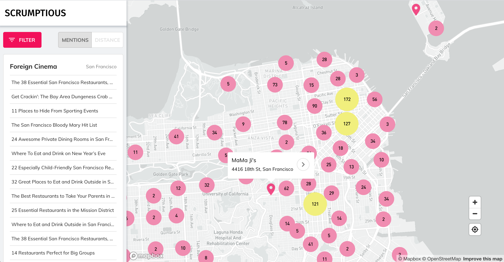
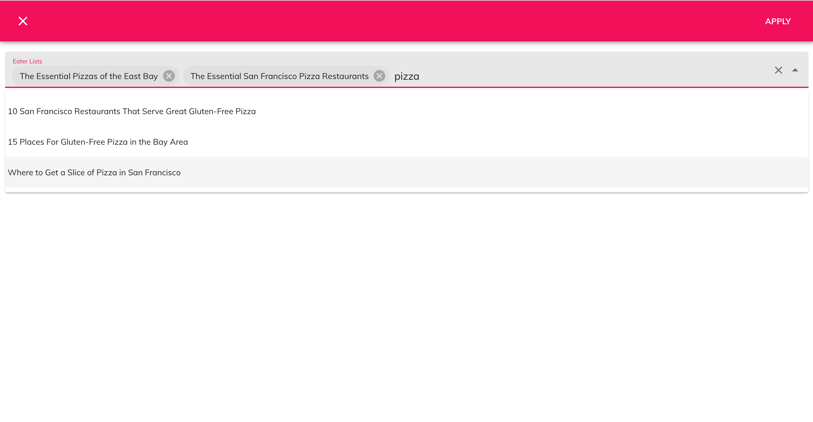
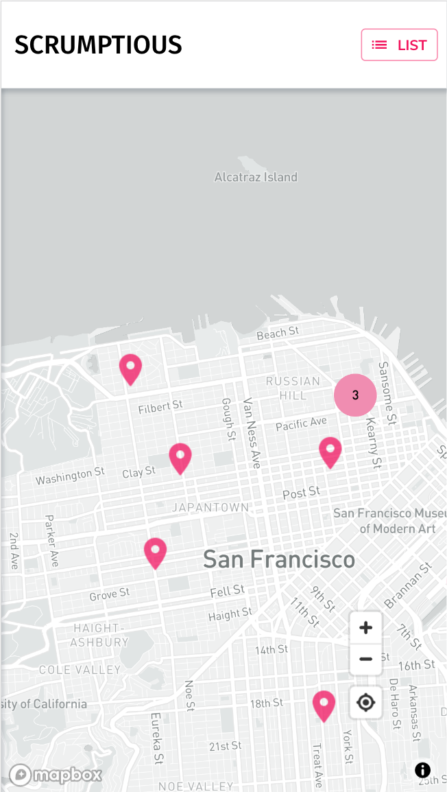
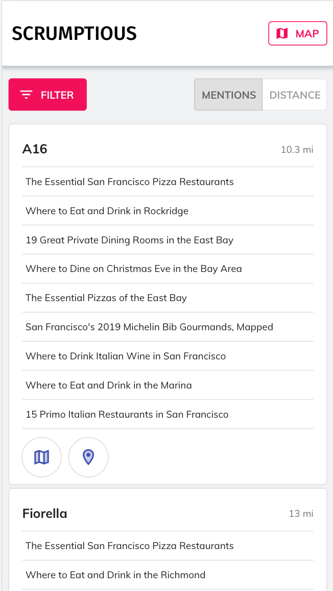

# Scrumptious

I'm a big fan of [Eater](https://www.eater.com/)'s restaurant recommendations. Unfortunately, there's no way to see all of their recommendations on one map. Inspired by [The Infatuation's "Finder" tool](https://www.theinfatuation.com/san-francisco#finder), I built one for them.

A live version of the app can be viewed [here](https://findscrumptious.herokuapp.com/).

## Demo

### Interactive Map

Visualizes all of Eater's recommendations on one map with a detailed sidebar that provides each restaurant as a card with additional information (e.g., referenced articles, location, google maps link) and functionality (filtering and sorting cards).  



### Geolocate User

The user can visualize himself on the map by enabling geolocation and then easily find nearby recommendations.  


### Filter

Filter functionality allows the user limit results by selecting specific Eater lists (e.g., Pizza, Michelin).  



### Responsive Design

In mobile view the map and cards are rendered independently.

  

## Development Overview

### Database

The Postgres database is populated by the Scrapy crawler in ```/database```.  

#### ```eater-spider.py```

```/database/eater/spiders/eater-spider.py``` is what actually scrapes articles and restaurants from Eater.com. Each item collected by the crawler is passed through a pipeline to be stored in the database.

#### ```pipelines.py```

```/database/eater/pipelines.py``` processes items scraped by the crawler.  

First, each item is passed through the ```DuplicatesPipeline```, which queries the database to determine if the item already exists.   

If new, the item is then passed to the ```RestaurantsPipeline```. Each restaurant's coordinates are parsed from the link to google maps provided by Eater. Some google maps URLs include only a ```place_id```. In these cases, I call the Google Maps API to access the latitude and longitude. Finally, the item is stored in the database.  

#### ```models.py```

```/database/eater/models.py``` creates the database connection and defines tables and associated schemata. The ```article``` and ```restaurant``` tables share a many-to-many relationship via ```restaurant_article```, since restaurants can appear on multiple articles.

### Server

The server is in the root directory in ```server.js``` and developed using Express. The server responds to client requests to two endpoints: 

#### ```/api/articles```

This endpoint queries postgres for all articles stored in the database. This is used to populate the filter dropdown.

#### ```/api/restaurants```

This endpoint queries postgres for all restaurants stored in the database. Additionally, ```lat``` and ```lng``` are optional query string parameters that the server will use to calculate the distance each restaurant is from the user. This happens whenever the geolocation feature is enabled.

### Client

The React.js client is housed in ```/client```. Implemented entirely with React Hooks, the front-end relies heavily upon the Material-UI and react-map-gl component libraries. I will provide a short summary of each component:  

#### ```<Nav />```

Navigation Bar at the top of the screen. In mobile view, it expands to full-width of the screen and provides a button to toggle between the list and map views. 

#### ```<Controls />```

Controls filtering and sorting restaurants. Material-UI's [Dialog](https://material-ui.com/components/dialogs/) render's ```<SelectLists />``` when "Filter" is triggered. Material-UI's [Toggle Buttons](https://material-ui.com/components/toggle-button/) is used to create the element that toggles sorting between "mentions" and "distance."

#### ```<SelectLists />```

Allows the user to search for and select multiple eater restaurants. Implemented using Material-UI's [AutoComplete](https://material-ui.com/components/autocomplete/).

#### ```<FoodList />```

Houses each restaurant in the form of ```<ListCard>```. Only shows 20 cards at first, with the option for the user to "Show More" at the bottom of the component. If a restaurant is selected on the map, the component will replace all of the cards with the only the selected restaurant's card.

#### ```<ListCard />```

Used to display information about each restaurant, such as links to Eater articles, a link to google maps, and a "fly to" trigger for the map. Material-UI's [Card](https://material-ui.com/components/cards/) provides the component structure and [List](https://material-ui.com/components/lists/) the element to list Eater articles.

#### ```<Map />```

Renders the MapBox map and houses all map-related components. Uses react-map-gl's [InteractiveMap](http://visgl.github.io/react-map-gl/docs/api-reference/interactive-map). 

#### ```<MapControls />```

Displays the map controls for geolocating the user and positioning the map. Clicking the geolocate control triggers a request to the server with the user's coordinates, so that restaurants can be sorted by distance from the user. Relies upon react-map-gl's [Navigation Control](http://visgl.github.io/react-map-gl/docs/api-reference/navigation-control) and [Geolocate Control](http://visgl.github.io/react-map-gl/docs/api-reference/geolocate-control). 

#### ```<MapPopup />```

Popup that renders when a restaurant is clicked on the map. Uses react-map-gl's [Popup Control](http://visgl.github.io/react-map-gl/docs/api-reference/popup).

#### ```<MapLayer />```

Renders the restaurant geojson data on the map, including clustering when zoomed out. Implemented using react-map-gl's [Source](http://visgl.github.io/react-map-gl/docs/api-reference/source) and [Layer](http://visgl.github.io/react-map-gl/docs/api-reference/layer).

## Technologies Overview

* [React](https://reactjs.org/)
* [Create-React-App](https://create-react-app.dev/)
* [Material-UI](https://material-ui.com/)
* [Uber's react-map-gl](https://github.com/visgl/react-map-gl)
* [Express](https://expressjs.com/)
* [Scrapy](https://scrapy.org/)
* [Postgres](https://www.postgresql.org/)
* [SQLAlchemy](https://www.sqlalchemy.org/)